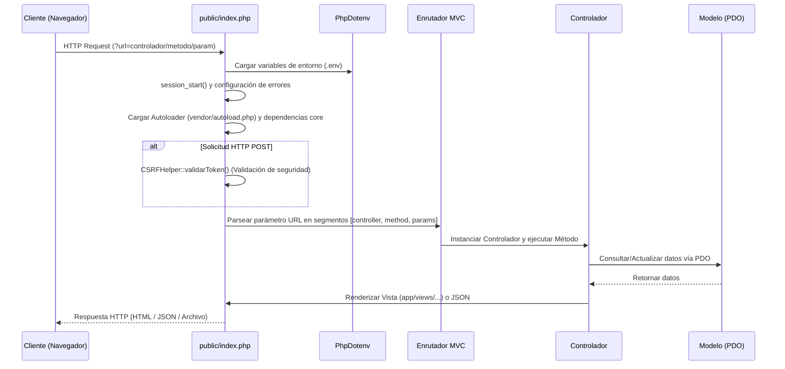
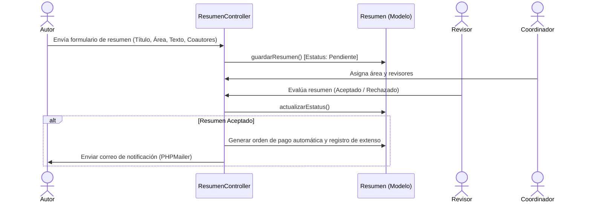
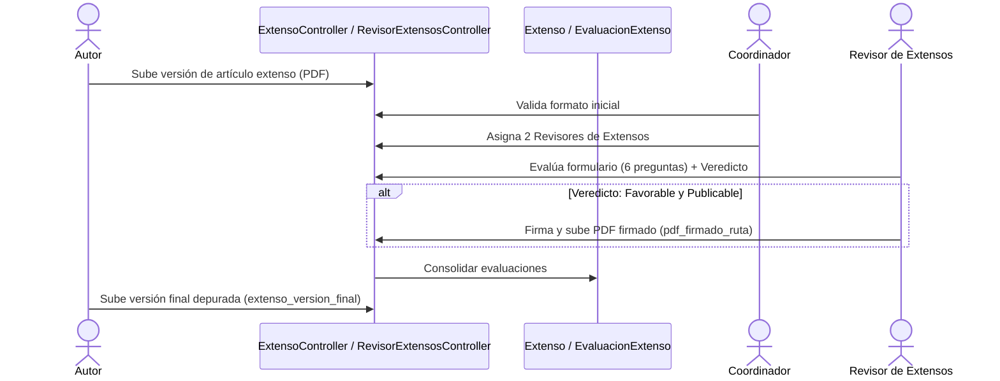
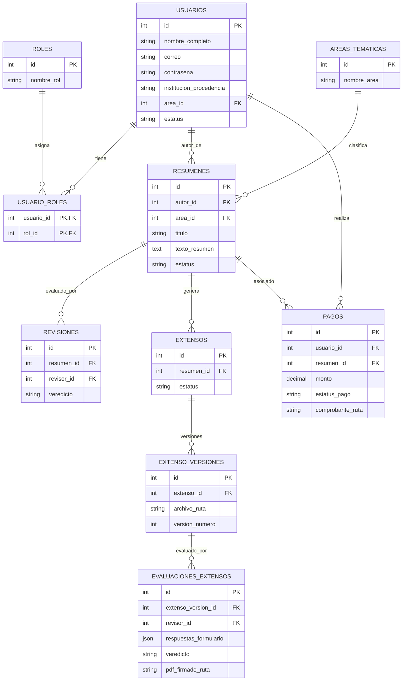

# Documentación Técnica del Proyecto Cortex

Esta documentación está diseñada para desarrolladores de software que se incorporan al proyecto **Cortex** (sistema de gestión para congresos y conferencias académicas, CCTI 2025). Aquí se detalla la arquitectura, el flujo de solicitudes, el modelo de datos, la seguridad y los diagramas de casos de uso.

---

## 1. Arquitectura y Estructura del Proyecto

Cortex está construido bajo un patrón arquitectónico **Modelo-Vista-Controlador (MVC)** personalizado en **PHP nativo**, sin un framework pesado de terceros, utilizando un enrutador centralizado (Front Controller).

### Estructura de Directorios

```text
cortex/
├── .env                          # Variables de entorno (DB, Mail, etc.)
├── .gitignore
├── composer.json                 # Dependencias PHP (vlucas/phpdotenv, phpmailer/phpmailer)
├── composer.lock
├── README.md
├── fasbited_ccti25.sql           # Esquema y datos iniciales de la base de datos
├── app/
│   ├── controllers/             # Controladores MVC por rol y funcionalidad
│   ├── helpers/                 # Utilidades (CSRFHelper, MailHelper)
│   ├── lib/                     # Librerías de terceros (FPDF 1.8.6)
│   ├── models/                  # Clases de acceso a datos y lógica de negocio (PDO)
│   └── views/                   # Plantillas de vista organizadas por módulos y roles
├── config/                      # Configuración de base de datos y aplicación
├── core/                        # Clases nucleares del framework
├── database/                    # Scripts SQL adicionales y respaldos
├── public/                      # Raíz web pública (index.php, .htaccess, assets)
├── uploads/                     # Archivos cargados por usuarios (comprobantes, extensos, fotos, SNI)
└── vendor/                      # Autoloader y paquetes de Composer
```

---

## 2. Pila Tecnológica (Tech Stack)

*   **Lenguaje**: PHP 8.x (Programación orientada a objetos, PDO).
*   **Base de Datos**: MySQL / MariaDB.
*   **Gestor de Dependencias**: Composer.
*   **Librerías Principales**:
    *   `vlucas/phpdotenv` (v5.6): Gestión de variables de entorno mediante `.env`.
    *   `phpmailer/phpmailer` (v6.10): Envío de correos electrónicos transaccionales y notificaciones.
    *   **FPDF** (v1.8.6 - embebido en `app/lib/fpdf186`): Generación de constancias y reportes PDF.
*   **Seguridad**:
    *   Control de acceso basado en roles (RBAC).
    *   Tokens anti-CSRF (`CSRFHelper`).
    *   Consultas preparadas con PDO (prevención de SQL Injection).

---

## 3. Ciclo de Vida de una Solicitud (Request Lifecycle)

Todas las solicitudes web son canalizadas a través del servidor web (Apache/IIS) hacia el punto de entrada único ubicado en `public/index.php`.

### Diagrama de Flujo del Front Controller (`public/index.php`)



---

## 4. Diagramas de Casos de Uso (Usecases)

### A. Flujo de Envío y Revisión de Resúmenes


### B. Flujo de Revisión y Firma de Artículos Completos (Extensos)


---

## 5. Modelo de Datos y Esquema Relacional

La base de datos (`fasbited_ccti25`) se estructura en las siguientes entidades principales:



---

## 6. Módulos y Componentes Clave

### Controladores (`app/controllers/`)
*   **`HomeController.php`**: Gestión de páginas de inicio y bienvenida.
*   **`UsuarioController.php`**: Autenticación (Login/Logout), registro de usuarios y gestión de perfiles.
*   **`ResumenController.php`**: Creación, listado y edición de resúmenes científicos.
*   **`ExtensoController.php`**: Carga de artículos completos y versiones de extensos.
*   **`PagoController.php`**: Subida y consulta de comprobantes de pago.
*   **`AdministradorController.php`**: Panel de control administrativo, gestión de usuarios, roles, estadísticas globales y exportación CSV.
*   **`CoordinadorController.php`**: Validación de áreas, asignación de revisores y control de flujos por temática.
*   **`RevisorController.php`** / **`RevisorExtensosController`** / **`RevisorPagosController`**: Dashboards específicos para dictaminadores de resúmenes, artículos completos y validación financiera.

### Modelos (`app/models/`)
Utilizan consultas PDO preparadas para interactuar con la base de datos de manera segura y eficiente. Destacan:
*   `Usuario.php`: Manejo de identidad y verificación de roles.
*   `Resumen.php`: Lógica de negocio para propuestas científicas.
*   `Extenso.php`: Control de versiones y estados de artículos completos.
*   `Pago.php`: Control financiero y estados de aprobación.

### Ayudantes y Utilidades (`app/helpers/`)
*   **`CSRFHelper.php`**: Genera y valida tokens hash SHA/MD5 almacenados en sesión para prevenir ataques de falsificación de peticiones en sitio cruzado.
*   **`MailHelper.php`**: Capa de abstracción sobre **PHPMailer** para despacho seguro de correos mediante SMTP configurado en `.env`.

---

## 7. Configuración y Puesta en Marcha (Entorno Local)

1.  **Requisitos**: PHP 8.x con extensiones `pdo_mysql`, `mbstring`, `fileinfo`, Composer y un servidor local (Apache/Nginx o PHP Built-in Server).
2.  **Clonación y Dependencias**:
    ```bash
    composer install
    ```
3.  **Configuración de Entorno**:
    Crear un archivo `.env` en la raíz del proyecto basado en la configuración requerida:
    ```env
    DB_HOST=localhost
    DB_USER=root
    DB_PASS=tu_contrasena
    DB_NAME=fasbited_ccti25
    MAIL_HOST=smtp.tuservidor.com
    MAIL_USER=tu_correo@dominio.com
    MAIL_PASS=tu_password
    ```
4.  **Base de Datos**:
    Importar los scripts SQL (`fasbited_ccti25.sql` y `database/extenso_version_final.sql`) en tu servidor MySQL/MariaDB.
5.  **Servidor de Desarrollo**:
    ```bash
    php -S localhost:8000 -t public
    ```
    Acceder a `http://localhost:8000` en el navegador.
